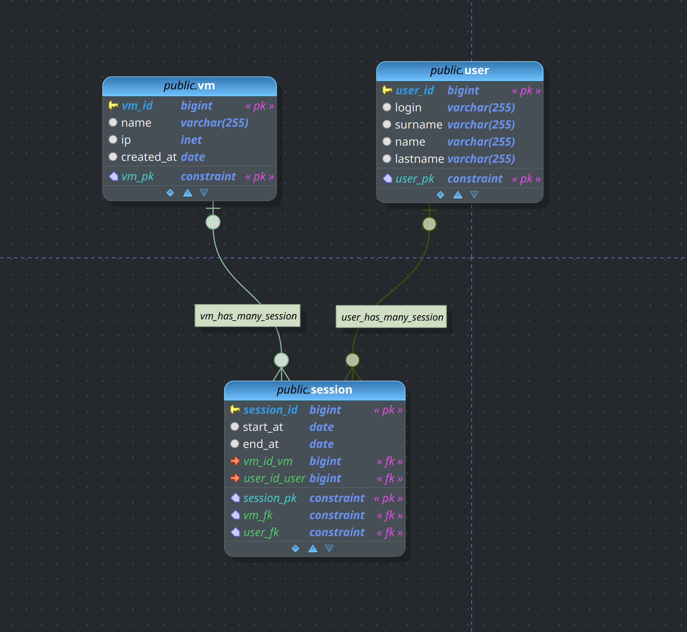

## Работа с индексами


Исходное [домашнее задание](./HW11.md "Дз 11")

Возьмем pgmodeler и накидаем простенькую БД




Создать индекс к какой-либо из таблиц вашей БД
Прислать текстом результат команды explain,
в которой используется данный индекс


```sql
PRIMARY key и есть индекс

hw_index=# \d "user" 
                        Table "public.user"
  Column  |          Type          | Collation | Nullable | Default 
----------+------------------------+-----------+----------+---------
 user_id  | bigint                 |           |          | 
 login    | character varying(255) |           |          | 
 surname  | character varying(255) |           |          | 
 name     | character varying(255) |           |          | 
 lastname | character varying(255) |           |          | 
Indexes:
    "user_user_id_idx" btree (user_id)

CREATE TABLE public.vm (
	vm_id bigint,
	name varchar(255),
	ip inet,
	created_at date,
	CONSTRAINT vm_pk PRIMARY KEY (vm_id)
);

CREATE TABLE public."user" (
	user_id bigint,
	login varchar(255),
	surname varchar(255),
	name varchar(255),
	lastname varchar(255),
	CONSTRAINT user_pk PRIMARY KEY (user_id)
);


CREATE TABLE public.session (
	session_id bigint NOT NULL GENERATED ALWAYS AS IDENTITY ,
	start_at date,
	end_at date,
	ip inet,
	vm_id_vm bigint,
	user_id_user bigint,
	CONSTRAINT session_pk PRIMARY KEY (session_id)
);
```

```sql
Индекс для join с другми таблицами
hw_index=# \dt
        List of relations
 Schema |  Name   | Type  | Owner 
--------+---------+-------+-------
 public | session | table | admin
 public | user    | table | admin
 public | vm      | table | admin
(3 rows)


hw_index=# INSERT INTO "user"
SELECT id, MD5(random()::TEXT)::TEXT, MD5(random()::TEXT)::TEXT, MD5(random()::TEXT)::TEXT, MD5(random()::TEXT)::TEXT
FROM generate_series(100, 200) AS id;
INSERT 0 101

hw_index=# explain analyze select * from "user" where user_id = 155;
                                            QUERY PLAN                                            
--------------------------------------------------------------------------------------------------
 Seq Scan on "user"  (cost=0.00..4.26 rows=1 width=140) (actual time=0.025..0.030 rows=1 loops=1)
   Filter: (user_id = 155)
   Rows Removed by Filter: 100
 Planning Time: 0.094 ms
 Execution Time: 0.046 ms
(5 rows)


```

```
SELECT relpages, reltuples FROM pg_class WHERE relname = 'user';
 relpages | reltuples 
----------+-----------
        3 |       101
(1 row)

hw_index=# show  seq_page_cost ;                                           
 seq_page_cost 
---------------
 1

hw_index=# show cpu_tuple_cost;
 cpu_tuple_cost 
----------------
 0.01
(1 row)
```
Какой ленивый postgres - действительно все записи укладываются в 3 страницы. использовать индекс нету смысла. проще пройти все 100 записей.  
cost = (disk pages read * seq_page_cost) + (rows scanned * cpu_tuple_cost). By default, seq_page_cost is 1.0 and cpu_tuple_cost is 0.01, so the estimated cost is (3 * 1.0) + (100 * 0.01) ~ 4.

```sql
Не трож мой cpu!

hw_index=# set cpu_tuple_cost TO 10;
SET

hw_index=# explain analyze select * from "user" where user_id = 155;
 QUERY PLAN
----------------------------------------------------------------------------------------------------------------------------
 Index Scan using user_user_id_idx on "user"  (cost=0.14..18.15 rows=1 width=140) (actual time=0.016..0.018 rows=1 loops=1)
   Index Cond: (user_id = 155)
 Planning Time: 0.082 ms
 Execution Time: 0.038 ms
(4 rows)

а добавим еще записей в таблицу
hw_index=# INSERT INTO "user"
SELECT id, MD5(random()::TEXT)::TEXT, MD5(random()::TEXT)::TEXT, MD5(random()::TEXT)::TEXT, MD5(random()::TEXT)::TEXT
FROM generate_series(2001, 20000) AS id;
INSERT 0 18000

hw_index=# set cpu_tuple_cost to DEFAULT ;
SET

QUERY PLAN
---------------------------------------------------------------------------------------------------------------------------
 Index Scan using user_user_id_idx on "user"  (cost=0.29..8.30 rows=1 width=140) (actual time=0.130..0.130 rows=1 loops=1)
   Index Cond: (user_id = 155)
 Planning Time: 2.234 ms
 Execution Time: 0.143 ms
(4 rows)
Теперь стало не выгодно использовать sec scan

Размер индекса
hw_index=# select relpages from pg_class where relname='user_user_id_idx';
 relpages 
----------
       57
```

Реализовать индекс для полнотекстового поиска
```sql
Хотим искать по логину и ФИО одновременно.

hw_index=# ALTER TABLE "user" ADD COLUMN content_tsvector TSVECTOR GENERATED ALWAYS
AS (to_tsvector('english', login) || to_tsvector('english', surname) || to_tsvector('english', name || to_tsvector('english', lastname)) ) STORED;
ALTER TABLE

hw_index=# CREATE INDEX idx_articles_content_tsvector ON "user" USING gin
(content_tsvector);
CREATE INDEX


hw_index=# explain analyze SELECT * FROM "user" WHERE content_tsvector @@
to_tsquery('english', '16ca:*');
QUERY PLAN
-----------------------------------------------------------------------------------------------------------------------------------------
 Bitmap Heap Scan on "user"  (cost=31.08..737.52 rows=398 width=172) (actual time=0.027..0.030 rows=2 loops=1)
   Recheck Cond: (content_tsvector @@ '''16ca'':*'::tsquery)
   Heap Blocks: exact=2
   ->  Bitmap Index Scan on idx_articles_content_tsvector  (cost=0.00..30.99 rows=398 width=0) (actual time=0.021..0.022 rows=2 loops=1)
         Index Cond: (content_tsvector @@ '''16ca'':*'::tsquery)
 Planning Time: 0.120 ms
 Execution Time: 0.056 ms
(7 rows)


hw_index=# SELECT user_id,login,surname,name,lastname FROM "user" WHERE content_tsvector @@
to_tsquery('english', '16ca:*');
 user_id |              login               |             surname              |               name               |             lastname             
---------+----------------------------------+----------------------------------+----------------------------------+----------------------------------
     581 | 16ca3ac9618f056d7d4ea5dc7dc2698e | 924b9ecaf19d77fd588e3e0d1969302c | c8fd4f432debef6afa6809771780c200 | bcc9952259de5d21ed3794d44a8cb95c
   12638 | c485bda16d2128bebf560d4e66c55320 | 16ca63796f231af989fc88bcc634b374 | ca78f2c531a3c1d3f6060a46bc7cb492 | 71071c938daa4406f47a21e7af550088
(2 rows)


hw_index=# SELECT TABLE_NAME,
	pg_size_pretty(table_size) AS table_size,
	pg_size_pretty(indexes_size) AS indexes_size,
	pg_size_pretty(total_size) AS total_size
FROM ( SELECT
	TABLE_NAME,
	pg_table_size(TABLE_NAME) AS table_size,
	pg_indexes_size(TABLE_NAME) AS indexes_size,
	pg_total_relation_size(TABLE_NAME) AS total_size
FROM ( SELECT ('"' || table_schema || '"."' || TABLE_NAME || '"')
AS TABLE_NAME FROM information_schema.tables
) AS all_tables
ORDER BY total_size DESC
) AS pretty_sizes \gx


-[ RECORD 1 ]+--------------------------------
table_name   | "public"."user"
table_size   | 6936 kB
indexes_size | 10040 kB
total_size   | 17 MB

Наш индекс занимает больше места чем данные
```

Реализовать индекс на часть таблицы или индекс
на поле с функцией

```sql
hw_index=# alter table "user" ADD COLUMN active bool DEFAULT 'false' ;
ALTER TABLE

hw_index=# update "user" SET active = 'true' where user_id < 300;
UPDATE 200

hw_index=# create index ON "user" ( active ) where active = 'true';
CREATE INDEX

hw_index=# explain analyze select count(*) from "user" where active \gx
-[ RECORD 1 ]---------------------------------------------------------------------------------------------------------------------------------
QUERY PLAN | Aggregate  (cost=1011.01..1011.02 rows=1 width=8) (actual time=0.088..0.089 rows=1 loops=1)
-[ RECORD 2 ]---------------------------------------------------------------------------------------------------------------------------------
QUERY PLAN |   ->  Bitmap Heap Scan on "user"  (cost=11.63..986.13 rows=9950 width=0) (actual time=0.027..0.076 rows=200 loops=1)
-[ RECORD 3 ]---------------------------------------------------------------------------------------------------------------------------------
QUERY PLAN |         Recheck Cond: active
-[ RECORD 4 ]---------------------------------------------------------------------------------------------------------------------------------
QUERY PLAN |         Heap Blocks: exact=11
-[ RECORD 5 ]---------------------------------------------------------------------------------------------------------------------------------
QUERY PLAN |         ->  Bitmap Index Scan on user_active_idx  (cost=0.00..9.14 rows=9950 width=0) (actual time=0.017..0.017 rows=200 loops=1)
-[ RECORD 6 ]---------------------------------------------------------------------------------------------------------------------------------
QUERY PLAN | Planning Time: 0.106 ms
-[ RECORD 7 ]---------------------------------------------------------------------------------------------------------------------------------
QUERY PLAN | Execution Time: 0.121 ms


 Aggregate  (cost=1011.01..1011.02 rows=1 width=8) (actual time=0.100..0.101 rows=1 loops=1)
   ->  Bitmap Heap Scan on "user"  (cost=11.63..986.13 rows=9950 width=0) (actual time=0.034..0.088 rows=200 loops=1)
         Recheck Cond: active
         Heap Blocks: exact=11
         ->  Bitmap Index Scan on user_active_idx  (cost=0.00..9.14 rows=9950 width=0) (actual time=0.023..0.024 rows=200 loops=1)
 Planning Time: 0.131 ms
 Execution Time: 0.135 ms
(7 rows)

А вот и обход всей таблицы:
explain analyze select count(*) from "user" where active='false' ;
 Aggregate  (cost=1098.88..1098.89 rows=1 width=8) (actual time=7.423..7.424 rows=1 loops=1)
   ->  Seq Scan on "user"  (cost=0.00..1074.01 rows=9950 width=0) (actual time=0.034..6.207 rows=19701 loops=1)
         Filter: (NOT active)
         Rows Removed by Filter: 200
 Planning Time: 0.128 ms
 Execution Time: 7.454 ms

```

Создать индекс на несколько полей

```sql
Уже создан полнотекстовый но давайте придумаем что то еще 

Например мы хотим искать быстро пользователя 
explain select * from "user" where login = '16ca3ac9618f056d7d4ea5dc7dc2698e' and active = 'false';
                                       QUERY PLAN                                        
-----------------------------------------------------------------------------------------
 Seq Scan on "user"  (cost=10000000000.00..10000001123.76 rows=1 width=173)
   Filter: ((NOT active) AND ((login)::text = '16ca3ac9618f056d7d4ea5dc7dc2698e'::text))
 JIT:
   Functions: 4
   Options: Inlining true, Optimization true, Expressions true, Deforming true
(5 rows)

hw_index=# create index ON "user" ( login , active ) ;
CREATE INDEX

hw_index=# explain select * from "user" where login = '16ca3ac9618f056d7d4ea5dc7dc2698e' and active = 'false';

QUERY PLAN
-------------------------------------------------------------------------------------------------
 Index Scan using user_login_active_idx on "user"  (cost=0.41..8.43 rows=1 width=173)
   Index Cond: (((login)::text = '16ca3ac9618f056d7d4ea5dc7dc2698e'::text) AND (active = false))
(2 rows)

нехилый такой прирост ) но такой себе конечно индекс. избыточно проще потом в коде проверить.
```
