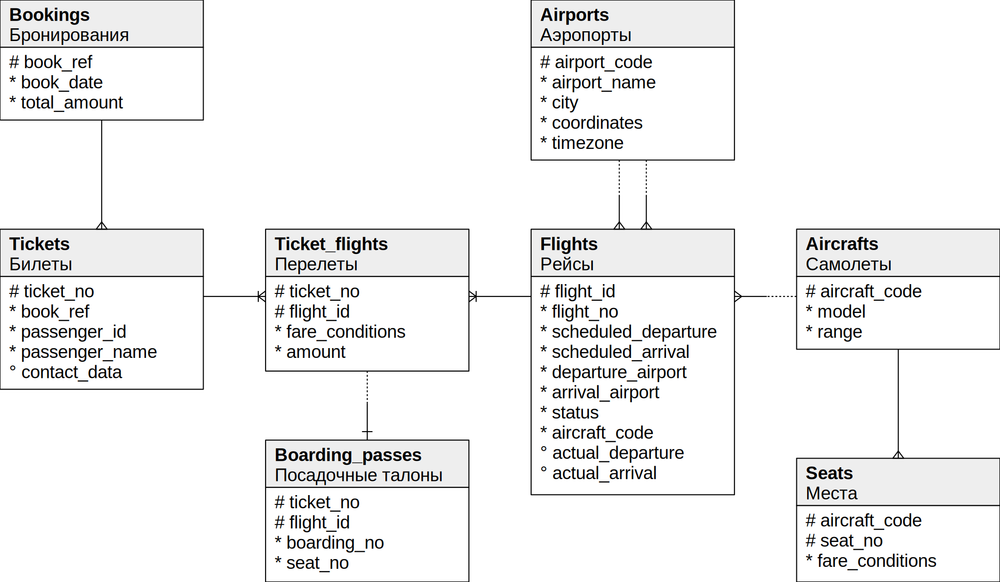

## Секционирование таблицы

Исходное [домашнее задание](./HW13.md "Дз 13")

Демонстрационная база flights:

https://postgrespro.com/community/demodb
https://postgrespro.ru/education/demodb

Скачаем демо базу медиум
```sh
> curl https://edu.postgrespro.ru/demo-medium.zip -o demo-medium.zip
  % Total    % Received % Xferd  Average Speed   Time    Time     Time  Current
                                 Dload  Upload   Total   Spent    Left  Speed
100 61.5M  100 61.5M    0     0  9375k      0  0:00:06  0:00:06 --:--:--  9.9M
```

Импортируем
```sql
# unzip -p demo-medium.zip |  psql -U $PG_USER -h db postgres
SET
SET
SET
SET
SET
SET
SET
SET
ERROR:  database "demo" does not exist
CREATE DATABASE
You are now connected to database "demo" as user "admin".
SET
SET
SET
SET
SET
SET
SET
SET
CREATE SCHEMA
COMMENT
CREATE EXTENSION
COMMENT
SET
CREATE FUNCTION
CREATE FUNCTION
COMMENT
SET
SET
CREATE TABLE
COMMENT
COMMENT
COMMENT
COMMENT
CREATE VIEW
COMMENT
COMMENT
COMMENT
COMMENT
CREATE TABLE
COMMENT
COMMENT
COMMENT
COMMENT
COMMENT
COMMENT
CREATE VIEW
COMMENT
COMMENT
COMMENT
COMMENT
COMMENT
COMMENT
CREATE TABLE
COMMENT
COMMENT
COMMENT
COMMENT
COMMENT
CREATE TABLE
COMMENT
COMMENT
COMMENT
COMMENT
CREATE TABLE
COMMENT
COMMENT
COMMENT
COMMENT
COMMENT
COMMENT
COMMENT
COMMENT
COMMENT
COMMENT
COMMENT
CREATE SEQUENCE
ALTER SEQUENCE
CREATE VIEW
COMMENT
COMMENT
COMMENT
COMMENT
COMMENT
COMMENT
COMMENT
COMMENT
COMMENT
COMMENT
COMMENT
COMMENT
COMMENT
COMMENT
COMMENT
COMMENT
COMMENT
COMMENT
COMMENT
COMMENT
COMMENT
CREATE VIEW
COMMENT
COMMENT
COMMENT
COMMENT
COMMENT
COMMENT
COMMENT
COMMENT
COMMENT
COMMENT
COMMENT
CREATE TABLE
COMMENT
COMMENT
COMMENT
COMMENT
CREATE TABLE
COMMENT
COMMENT
COMMENT
COMMENT
COMMENT
CREATE TABLE
COMMENT
COMMENT
COMMENT
COMMENT
COMMENT
COMMENT
ALTER TABLE
COPY 9
COPY 104
COPY 1894295
COPY 593433
COPY 65664
COPY 1339
COPY 2360335
COPY 829071
ALTER TABLE
ALTER TABLE
ALTER TABLE
ALTER TABLE
ALTER TABLE
ALTER TABLE
ALTER TABLE
ALTER TABLE
ALTER TABLE
ALTER TABLE
ALTER TABLE
ALTER TABLE
ALTER TABLE
ALTER TABLE
ALTER TABLE
ALTER TABLE
ALTER TABLE
ALTER TABLE
ALTER TABLE
ALTER DATABASE
ALTER DATABASE
```

```sql
postgres=# \l
                             List of databases
   Name    | Owner | Encoding |  Collate   |   Ctype    | Access privileges
-----------+-------+----------+------------+------------+-------------------
 demo      | admin | UTF8     | en_US.utf8 | en_US.utf8 |
 pg_hw11   | admin | UTF8     | en_US.utf8 | en_US.utf8 |
 postgres  | admin | UTF8     | en_US.utf8 | en_US.utf8 |
 template0 | admin | UTF8     | en_US.utf8 | en_US.utf8 | =c/admin         +
           |       |          |            |            | admin=CTc/admin
 template1 | admin | UTF8     | en_US.utf8 | en_US.utf8 | =c/admin         +
           |       |          |            |            | admin=CTc/admin
(5 rows)
```

```sql
demo=# SELECT
    table_name,
    pg_size_pretty(table_size) AS table_size,
    pg_size_pretty(indexes_size) AS indexes_size,
    pg_size_pretty(total_size) AS total_size
FROM (
    SELECT
        table_name,
        pg_table_size(table_name) AS table_size,
        pg_indexes_size(table_name) AS indexes_size,
        pg_total_relation_size(table_name) AS total_size
    FROM (
        SELECT ('"' || table_schema || '"."' || table_name || '"') AS table_name
        FROM information_schema.tables
    ) AS all_tables
    ORDER BY total_size DESC
) AS pretty_sizes limit 5;

          table_name          | table_size | indexes_size | total_size
------------------------------+------------+--------------+------------
 "bookings"."boarding_passes" | 109 MB     | 155 MB       | 263 MB
 "bookings"."ticket_flights"  | 154 MB     | 91 MB        | 245 MB
 "bookings"."tickets"         | 109 MB     | 25 MB        | 134 MB
 "bookings"."bookings"        | 30 MB      | 13 MB        | 42 MB
 "bookings"."flights"         | 6368 kB    | 3504 kB      | 9872 kB
```
Секционированные таблицы не обнаружены 
```sql
 demo=# select count(1) from pg_catalog.pg_partitioned_table;
 count
-------
     0
(1 row)
```

Схема базы данных flights




Предлагаю секционировать bookings (бронирования)

```sql
demo=# select count(book_ref) from bookings;
 count
--------
 593433
(1 row)

demo=# select count(flight_id) from flights;
 count
-------
 65664
(1 row)
```
Допустим у нас пользователи стали страдать долгим поиском своей брони
```sql
demo=# explain analyze select * from bookings where book_ref='203B66';
                                                         QUERY PLAN
-----------------------------------------------------------------------------------------------------------------------------
 Index Scan using bookings_pkey on bookings_old  (cost=0.42..8.44 rows=1 width=21) (actual time=1.478..1.479 rows=0 loops=1)
   Index Cond: (book_ref = '203B66'::bpchar)
 Planning Time: 0.599 ms
 Execution Time: 1.523 ms
(4 rows)```

Создадим секционированную таблицу по хэшу
```sql
demo=# CREATE TABLE bookings_p (
       book_ref     character(6),
       book_date    timestamptz,
       total_amount numeric(10,2),
       CONSTRAINT bookings_p_pkey PRIMARY KEY (book_ref)
   ) PARTITION BY HASH(book_ref);
CREATE TABLE
```
Будем разбивать на 8 партиций 
```sql

demo=# CREATE TABLE bookings_0 PARTITION OF bookings_p FOR VALUES WITH (MODULUS 8, REMAINDER 0);
CREATE TABLE bookings_1 PARTITION OF bookings_p FOR VALUES WITH (MODULUS 8, REMAINDER 1);
CREATE TABLE bookings_2 PARTITION OF bookings_p FOR VALUES WITH (MODULUS 8, REMAINDER 2);
CREATE TABLE bookings_3 PARTITION OF bookings_p FOR VALUES WITH (MODULUS 8, REMAINDER 3);
CREATE TABLE bookings_4 PARTITION OF bookings_p FOR VALUES WITH (MODULUS 8, REMAINDER 4);
CREATE TABLE bookings_5 PARTITION OF bookings_p FOR VALUES WITH (MODULUS 8, REMAINDER 5);
CREATE TABLE bookings_6 PARTITION OF bookings_p FOR VALUES WITH (MODULUS 8, REMAINDER 6);
CREATE TABLE bookings_7 PARTITION OF bookings_p FOR VALUES WITH (MODULUS 8, REMAINDER 7);
CREATE TABLE
CREATE TABLE
CREATE TABLE
CREATE TABLE
CREATE TABLE
CREATE TABLE
CREATE TABLE
CREATE TABLE
```
Получим следующую таблицу
```sql
demo=# \d+ bookings_p;
                                            Partitioned table "bookings.bookings_p"
    Column    |           Type           | Collation | Nullable | Default | Storage  | Compression | Stats target | Description
--------------+--------------------------+-----------+----------+---------+----------+-------------+--------------+-------------
 book_ref     | character(6)             |           | not null |         | extended |             |              |
 book_date    | timestamp with time zone |           |          |         | plain    |             |              |
 total_amount | numeric(10,2)            |           |          |         | main     |             |              |
Partition key: HASH (book_ref)
Indexes:
    "bookings_p_pkey" PRIMARY KEY, btree (book_ref)
Partitions: bookings_0 FOR VALUES WITH (modulus 8, remainder 0),
            bookings_1 FOR VALUES WITH (modulus 8, remainder 1),
            bookings_2 FOR VALUES WITH (modulus 8, remainder 2),
            bookings_3 FOR VALUES WITH (modulus 8, remainder 3),
            bookings_4 FOR VALUES WITH (modulus 8, remainder 4),
            bookings_5 FOR VALUES WITH (modulus 8, remainder 5),
            bookings_6 FOR VALUES WITH (modulus 8, remainder 6),
            bookings_7 FOR VALUES WITH (modulus 8, remainder 7)
```
Перенесем все записи из bookings в bookings_p
```sql
demo=# INSERT INTO bookings_p SELECT * FROM bookings;
INSERT 0 593433
```
Посмотрим распределение по секциям - почти равномерно
```sql
demo=#
 SELECT
    table_name,
    pg_size_pretty(table_size) AS table_size,
    pg_size_pretty(indexes_size) AS indexes_size,
    pg_size_pretty(total_size) AS total_size
FROM (
    SELECT
        table_name,
        pg_table_size(table_name) AS table_size,
        pg_indexes_size(table_name) AS indexes_size,
        pg_total_relation_size(table_name) AS total_size
    FROM (
        SELECT ('"' || table_schema || '"."' || table_name || '"') AS table_name
        FROM information_schema.tables
        WHERE table_name like 'booking_%'
    ) AS all_tables
    ORDER BY total_size DESC
) AS pretty_sizes;
       table_name        | table_size | indexes_size | total_size
-------------------------+------------+--------------+------------
 "bookings"."bookings"   | 30 MB      | 13 MB        | 42 MB
 "bookings"."bookings_2" | 3832 kB    | 1648 kB      | 5480 kB
 "bookings"."bookings_3" | 3832 kB    | 1648 kB      | 5480 kB
 "bookings"."bookings_0" | 3824 kB    | 1648 kB      | 5472 kB
 "bookings"."bookings_5" | 3824 kB    | 1640 kB      | 5464 kB
 "bookings"."bookings_4" | 3816 kB    | 1640 kB      | 5456 kB
 "bookings"."bookings_1" | 3808 kB    | 1632 kB      | 5440 kB
 "bookings"."bookings_6" | 3800 kB    | 1632 kB      | 5432 kB
 "bookings"."bookings_7" | 3800 kB    | 1632 kB      | 5432 kB
 "bookings"."bookings_p" | 0 bytes    | 0 bytes      | 0 bytes
(10 rows)
```
Поправим зависимые таблицы 
```sql
demo=# alter table tickets drop constraint tickets_book_ref_fkey;
ALTER TABLE
demo=# alter table tickets add constraint tickets_book_ref_fkey foreign key (book_ref) references bookings_p (book_ref);
ALTER TABLE

alter table bookings rename to bookings_old;
alter table bookings_p rename to bookings;
ALTER TABLE
ALTER TABLE
```

Получим в итоге более быстрый поиск в секционированной таблице. log n - поиск по бинарному дереву. Чем меньше записей в таблице тем быстрее поиск.

```sql
demo=# explain analyze select * from bookings where book_ref='203B66';
                                                              QUERY PLAN
--------------------------------------------------------------------------------------------------------------------------------------
 Index Scan using bookings_1_pkey on bookings_1 bookings  (cost=0.29..8.31 rows=1 width=21) (actual time=0.021..0.022 rows=0 loops=1)
   Index Cond: (book_ref = '203B66'::bpchar)
 Planning Time: 1.567 ms
 Execution Time: 0.050 ms
(4 rows)
```